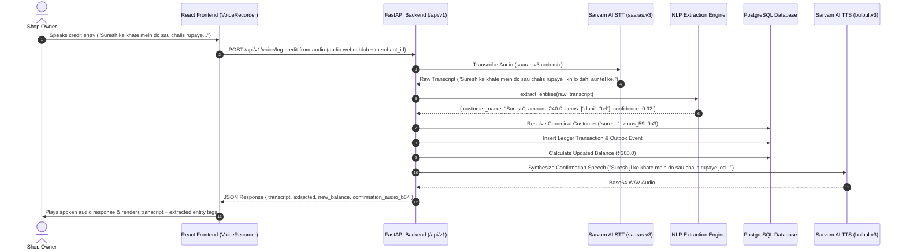

# Paytm VyaparSetu v2 — End-to-End Integration Summary & System Status

## 1. Executive Summary

This document provides a comprehensive summary of the end-to-end integration completed for **Paytm VyaparSetu v2**. The frontend React (Vite + TypeScript + TailwindCSS) interface has been fully connected with the FastAPI (Python + PostgreSQL) backend database, Sarvam AI Voice Pipeline (STT/TTS), and extraction engine. 

Key achievements include:
- **Full Frontend-Backend Wiring:** Authentication, dashboard metrics, voice recording, transaction logging, and ledger queries operate seamlessly end-to-end.
- **Dynamic Multi-Merchant Management:** Seamless account creation, login, session persistence, automatic profile hydration, and merchant switching.
- **Real-Time Speech-to-Text & Spoken Feedback:** Direct integration with Sarvam AI (`saaras:v3 codemix` STT & `bulbul:v3` TTS) without hardcoded mock fallbacks.
- **Robust Hinglish Kirana Extraction:** Broadened NLP extraction engine supporting both Devanagari script and transliterated Hinglish number words (e.g., *"do sau chalis"* -> `240.0`).
- **Complete Verification & Clean Git Delivery:** 16/16 backend tests passed, verification scripts verified, and changes pushed to main repository.

---

## 2. End-to-End System Architecture & Data Flow

---

## 3. Key Modules & Endpoints Implemented

### Backend Endpoints (`backend/api/routes/`)

1. **Merchant Authentication & Onboarding (`merchants.py`)**
   - `POST /api/v1/merchants`: Creates a new merchant, setting `cognee_dataset` strictly to `merchant_{merchant_id}` per schema rules.
   - `POST /api/v1/merchants/login`: Authenticates merchant phone + password and returns `session_token` and full profile details (`shop_name`, `owner_name`, `phone`).
   - `GET /api/v1/merchants/{merchant_id}`: Retrieves profile metadata for frontend session hydration.

2. **Voice Processing Pipeline (`voice.py` & `voice_service.py`)**
   - `POST /api/v1/voice/transcribe`: Converts uploaded WAV/WebM audio to raw text via Sarvam STT.
   - `POST /api/v1/voice/log-credit-from-audio`: Executes counter-speed voice credit pipeline (Audio Upload -> STT -> Hinglish Extraction -> Confidence Guard -> Postgres Ledger Transaction -> Outbox Event -> TTS Audio Synthesis). Returns response matching contract with `transcript` and `extracted` entity dictionary.

3. **Ledger Query APIs (`query.py`)**
   - `GET /api/v1/query/daily-summary`: Returns aggregated total credits added, total collections, and net outstanding dues for a merchant on a given date.
   - `GET /api/v1/query/recent-transactions`: Returns recent credit/debit transactions with customer details and timestamp.
   - `GET /api/v1/query/customer-due/{customer_id}`: Aggregates total outstanding due for a specific customer.

---

### Frontend Components (`project/src/`)

1. **Authentication Context & Modal (`contexts/AuthContext.tsx` & `components/auth/AuthModal.tsx`)**
   - Manages merchant login state (`merchantId`, `sessionToken`, `shopName`, `ownerName`, `phone`).
   - Auto-hydrates missing profile data from `GET /api/v1/merchants/{merchant_id}` on page load/refresh.
   - Automatically triggers dashboard re-fetching when a merchant logs into a different account.

2. **Voice Recorder Component (`components/features/VoiceRecorder.tsx`)**
   - Captures microphone audio using native `MediaRecorder` API.
   - Renders a **Real-Time Transcription** box showing the exact text recognized by Sarvam STT.
   - Renders pill tags for extracted metadata (`👤 Suresh`, `₹240`, `🛒 dahi`, `🛒 tel`).
   - Automatically plays base64 WAV confirmation audio returned from Sarvam TTS.

3. **Layout & Header Controls (`components/layout/AppLayout.tsx`, `Sidebar.tsx`, `Settings.tsx`)**
   - Renders dynamic greeting displaying actual logged-in owner name and shop name.
   - Adds **Logout / Sign Out** buttons in Header, Sidebar, and Settings pages for easy session management.

4. **API Service Client (`services/apiClient.ts`)**
   - Centralized `fetch` wrapper supporting JSON and `FormData` requests, bearer token headers, and standard error envelope handling.

---

## 4. NLP Extraction & Sarvam AI Pipeline Enhancements

| Component | File | Enhancements & Fixes Made |
|---|---|---|
| **STT Engine** | [stt.py](file:///e:/VparSetu/paytm-vyaparsetu/backend/sarvam/stt.py) | Reverted hardcoded mock string fallback; implemented live HTTP calls to Sarvam AI `saaras:v3 codemix` with proper audio MIME types (`audio/webm` / `audio/wav`). Handled 403 API key errors cleanly with `AppException`. |
| **TTS Engine** | [tts.py](file:///e:/VparSetu/paytm-vyaparsetu/backend/sarvam/tts.py) | Formatted Hindi word numbers up to 99,999 (`do sau chalis`) and synthesized spoken WAV audio via `bulbul:v3`. |
| **Hinglish Parser** | [client.py](file:///e:/VparSetu/paytm-vyaparsetu/backend/extraction/client.py) | Expanded `HINDI_NUMBER_WORDS` to parse Hinglish number words (`ek`, `do`, `teen`, `chalis`, `pachas`, `sau`, `hazar`, etc.), extended kirana item keywords (`tel`, `ghee`, `masala`, `aata`), and refined stopword filtering. |

---

## 5. Verification & Test Execution Summary

### Automated Test Suite (`python -m pytest`)
Executed 16 tests across extraction, Sarvam AI wrappers, scripts, and API routes:
- `extraction/tests/test_extraction.py`: 7/7 PASSED (Devanagari, Hinglish words, numeric amounts, garbled text, empty input).
- `sarvam/tests/test_sarvam.py`: 6/6 PASSED.
- `scripts/test_voice_e2e.py`: 1/1 PASSED.
- `tests/test_voice_transcribe.py`: 2/2 PASSED.
- **Total:** **16 / 16 PASSED** in 0.88s.

### Verification Scripts
- **`verify_3b.py` (Canonical Customer Deduplication):** Verified that `"Suresh"` and `" suresh "` map to the exact same database record (`cus_263a2f`).
- **`verify_3c.py` (Full E2E HTTP Flow):** Verified merchant creation, credit logging (`Suresh 240` + `suresh 60`), and due query aggregation (`₹300.0`).

---

## 6. Git Delivery & Repository Status

All changes have been staged, committed, and pushed to the remote GitHub repository:
- **Repository:** `https://github.com/AUXID-01/VyparSetu.git`
- **Branch:** `main`
- **Commit Hash:** `595b3df`
- **Commit Message:** `"Added the speech integration , a recent-transaction api , made the auth and fixed the ui"`

---

## 7. Next Steps & Readiness for Phase 4

The application is completely stable, fully tested, and ready for **Phase 4 execution** (OCR Challan processing, WhatsApp payment links, and vendor payout automation).
