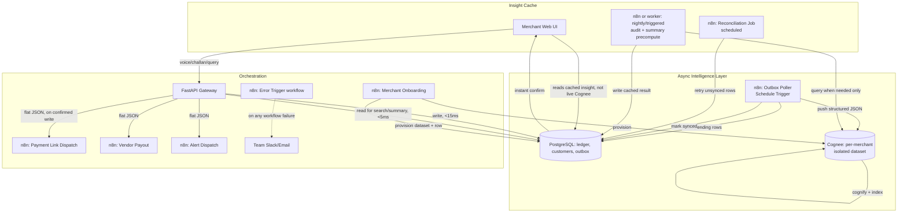

# Paytm VyaparSetu v2 — Production Architecture & Hackathon Execution Plan
*Supersedes the earlier pipeline-plan and build-plan docs. This version incorporates real benchmark findings from practicing with Cognee and n8n, and a frontend-first build strategy.*

---

## 0. What changed and why

Practical load-testing surfaced five hard facts that reshape the architecture:

| Finding | Consequence |
|---|---|
| `cognee.search()` averages ~51s | Cognee can never sit on any user-facing path, sync or async-blocking |
| Stale reads by write #10 under load | Never treat a fresh Cognee read as authoritative for balances |
| No native dedup in `add()` | Idempotency must be enforced upstream, in Postgres, before Cognee ever sees an event |
| Casing splits entities (`Suresh` vs `suresh`) | Identity resolution must happen in the app layer, never left to Cognee |
| Shared datasets cross-contaminate via date nodes | One isolated Cognee dataset per merchant, no exceptions |

**Net effect:** Postgres is now the source of truth and the only thing on the merchant-facing critical path. Cognee is demoted to a background intelligence layer that produces cached insights, never queried live per-request. n8n is the glue that moves confirmed events between the two and out to the customer/vendor — and, per your n8n Cloud access, does more of the "async worker" job itself rather than a hand-rolled Celery process.

---

## 1. Updated system topology



Key rule carried forward unchanged: **no arrow from Cognee ever points directly at the merchant UI.** Everything the merchant sees synchronously comes from Postgres.

---

## 2. Component responsibilities (final)

| Component | Owns | Never does |
|---|---|---|
| **PostgreSQL** | Ledger entries, customer balances, invoices, outbox table, cached insight results, canonical customer identity | Semantic reasoning, fuzzy matching |
| **FastAPI** | Request validation, calling Postgres, writing outbox rows, firing n8n webhooks on confirmed writes | Waiting on Cognee before responding to the merchant |
| **Cognee** (per-merchant isolated dataset) | Rate-hike audits across invoices, semantic Q&A synthesis, fuzzy SKU/vocabulary reconciliation | Real-time balance math, anything on a request path |
| **n8n Cloud** | Outbox polling/push to Cognee, reconciliation retries, WhatsApp/SMS dispatch, vendor payout with success/fail branching, error alerting, merchant onboarding automation | Business math (keep n8n nodes thin — Set/If/Switch/HTTP, not embedded Function-node logic doing ledger arithmetic) |

---

## 3. The outbox + idempotency pattern (closes the dedup gap)

```sql
-- Added to the schema specifically to fix "no native idempotency in Cognee"
CREATE TABLE outbox_events (
    event_id UUID PRIMARY KEY,          -- stable idempotency key, generated once at write time
    merchant_id TEXT NOT NULL,
    event_type TEXT NOT NULL,           -- 'credit_added', 'invoice_created', 'settlement_rollup'
    payload JSONB NOT NULL,             -- canonical IDs only — no raw customer names
    status TEXT NOT NULL DEFAULT 'PENDING',   -- PENDING -> SYNCED | FAILED
    created_at TIMESTAMPTZ DEFAULT now(),
    synced_at TIMESTAMPTZ,
    attempt_count INT DEFAULT 0
);
```

Flow: FastAPI writes the ledger row **and** the outbox row in the same DB transaction → n8n's Schedule Trigger polls `WHERE status = 'PENDING'` → pushes to Cognee → on success, calls back to a small FastAPI endpoint that flips `status = 'SYNCED'`. If n8n crashes mid-push, the row is still `PENDING` and gets picked up next poll — the `event_id` is the idempotency key, so even if Cognee received it once already, the reconciliation job can safely check before re-adding (or you accept occasional harmless re-adds to a background-only dataset, since it never feeds live balance math anymore anyway).

This is also your **identity resolution fix**: `payload` should only ever contain `customer_id` (resolved via phone number in Postgres, never raw name text), so Cognee never has the chance to create a duplicate node from casing differences.

---

## 4. n8n Cloud workflow set (final list)

| Workflow | Trigger | Purpose | Notes |
|---|---|---|---|
| **Outbox Poller** | Schedule Trigger (e.g. every 10–15s) | Pull pending outbox rows, push to Cognee, mark synced | This *is* your async bridge — no separate Celery worker needed |
| **Reconciliation Job** | Schedule Trigger (e.g. every 5 min) | Find rows stuck `PENDING` past a threshold, retry with backoff | Directly answers the stale-write finding |
| **Payment Link Dispatch** | Webhook (from FastAPI, on confirmed ledger write) | WhatsApp/SMS with UPI link | Flat JSON payload only |
| **Vendor Payout** | Webhook | Mock Paytm payout call, success/fail `If` branch, callback to mark invoice paid | Keep the ₹10,000 test-threshold branching you already validated |
| **Alert Dispatch** | Webhook | `Switch` on `alert_type` (rate_spike / low_balance) | Already proven isolated in your testing |
| **Error Trigger** | n8n's built-in error workflow hook | Any workflow failure → Slack/email to team | New — turns failures visible instead of silent |
| **Merchant Onboarding** | Webhook (new merchant signup) | Create Postgres row + provision isolated Cognee dataset name (`merchant_<id>`) + welcome WhatsApp | New — good demo moment, shows automation doing real provisioning work |

Practical n8n Cloud tips: use the credential vault for all API keys (Sarvam, WhatsApp/Twilio, mock Paytm) rather than hardcoding in nodes; set per-node retry-on-fail with backoff instead of hand-rolling retries in a Function node; pin sample execution data on the workflows you'll demo live, so judge-day doesn't depend on a third-party API cooperating in real time; factor the "send WhatsApp message" logic into one sub-workflow called from both Payment Link Dispatch and Alert Dispatch rather than duplicating nodes.

---

## 5. Build sequence (matches your desired flow, with the fixes folded in)

| Phase | What | Tool |
|---|---|---|
| **1. Full visual frontend** | All screens: voice recorder, challan upload, dues dashboard, audit alert cards, settlement panel, and a judge-facing landing/pitch page with the Integration Blueprint section (see §6). Mocked data, real animations/polish. | Lovable or Bolt.new (build the full app); optionally v0.dev to polish 1–2 hero screens further |
| **2. Export → local** | Pull the ZIP into your local repo, open in Antigravity | Antigravity |
| **3. Postgres + FastAPI skeleton** | Schema incl. `outbox_events`, canonical customer identity table; wire UI's voice/query screens to real endpoints (extraction still hardcoded JSON for now) | Antigravity agents + manual review |
| **4. Sarvam STT + TTS, fully wired** | Real audio in, real structured JSON out, confirmation audio back — tested against Postgres end-to-end | |
| **5. Challan flow + Postgres** | Vision extraction → merchant confirm step → Postgres write (still plain SQL rate comparison, no Cognee yet) | |
| **6. Full integration pass, no Cognee/n8n yet** | The entire counter-speed path (voice + challan + dashboard) working and demoable on its own — this alone should never break | |
| **7. Cognee, isolated per-merchant datasets** | `outbox_events` table live, canonical-ID-only payloads, no live search anywhere | |
| **8. n8n Cloud, full workflow set** | All seven workflows from §4, wired to real webhooks | n8n Cloud |
| **9. Connect and test complete flow** | Kill n8n mid-sync, confirm reconciliation catches it; send duplicate events, confirm idempotency holds; verify UI sync-status badge reflects reality | |
| **10. Demo polish** | Pinned n8n test data, sync-status badge, Integration Blueprint copy finalized, run the full demo twice back-to-back | |

---

## 6. Panel framing — "product + integration surface"

The website is the demo, but the pitch is: *this already runs standalone, and connecting it to the real Paytm for Business dashboard is a connector, not a rewrite.* Concretely, add one section to the site itself:

- A short **"Integration Blueprint"** panel showing the actual REST endpoints (`POST /v1/voice/log-credit`, `POST /v1/challan/extract`, `GET /v1/query/summary`) and a 3–4 line example of a partner backend calling them.
- One sentence framing it explicitly: *"VyaparSetu ships as a documented API and embeddable widget — Paytm's existing merchant app can call it directly rather than adopting a new platform."*
- This costs you almost nothing to build (it's mostly copy + your existing API contracts from `models/schemas.py`) but materially changes how judges perceive scope: a finished feature versus a hackathon toy.

---

## 7. Open items to settle between you two before Phase 3

- Exact polling interval for the Outbox Poller (tradeoff: demo-visible speed vs. n8n Cloud execution quota usage — check your plan's execution limits before setting this very low)
- Whether the merchant-confirm step on challan OCR blocks the UI or is a dismissible toast (affects Phase 5 UX)
- Who owns the Integration Blueprint copy (§6) — good task for whoever finishes their backend phase first
