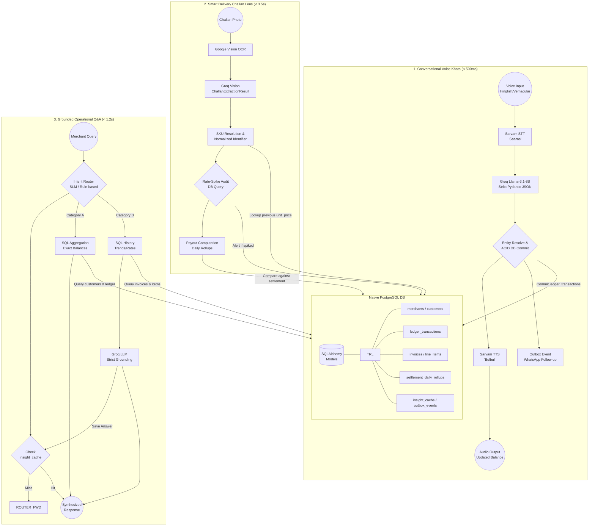

# Paytm VyaparSetu System Architecture (Native PostgreSQL)

This architecture reflects the updated, high-performance production pipeline operating entirely on local infrastructure, bypassing legacy external vector databases or graph engines. All queries, extraction, and ledger math are grounded firmly in ACID-compliant SQLAlchemy models.

### Architectural Principles Enforced:
*   **No Hallucinations:** The LLM generates natural language exclusively from injected SQL row data. If SQL returns an empty set, the fallback behavior is triggered (`"Mere paas iski jaankari nahi hai"`).
*   **Zero-Overhead Q&A:** Explicit exact queries (like pending balance) hit SQL native aggregates (`SUM(CASE WHEN...)`) and bypass the LLM completely for maximum speed.
*   **Fast Extraction:** Voice transactions use small, blazing fast models (Groq Llama-3.1-8B) to map messy vernacular audio strictly to Pydantic objects.
*   **Auditable:** Every piece of data lives on-premise in the relational PostgreSQL database with strong constraints, foreign keys, and indexes.
